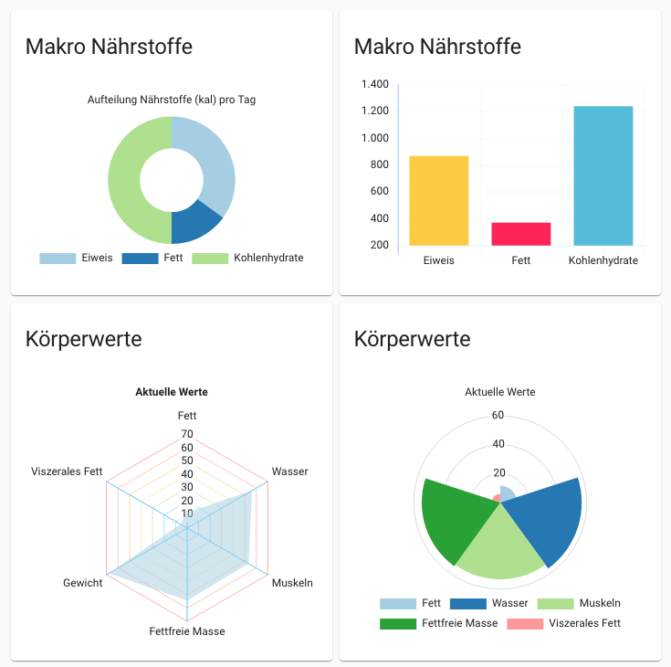

# Lovelace - graph-chartjs-card

Chart.js card for Home Assistant -  Visualize your data in 8 different ways; each of them animated and customisable.

> DEVELOPER PREVIEW VERSION




## Requirements

- Home Assistant 0.116.4
  - Frontend-Version: 20201001.2 - latest
  - Lovelace Mode
- Tested Browser
  - Chrome Version 86.0.4240.111 
  - Safari Version 13.1.2 (13609.3.5.1.5)
  - Firefox 82.0 (64-Bit)
  - Vivaldi 3.4.2066.76 (Stable channel) (x86_64)
  - Android Browser (Chrome, Firefox, Vivaldi)
- Lovelace chart-card (Chart.js v3.0.0-beta.5)

<br>

## Installation

### Manual install

1. Download the [latest release](https://github.com/zibous/lovelace-graph-chart-card/releases), unzip and copy the folder `chart-card` into your `config/www/community` directory.
<br />
2. Add a reference to `chart-card-min.js` inside your `ui-lovelace.yaml` or at the top of the *raw config editor UI*:

    ```yaml
    resources:
      - url: /hacsfiles/chart-card/chart-card-min.js
        type: module
    ```
<br>

## Using the card

### Card options

| Name           | Type     | Default     | Description |
| -------------- | -------- | ----------- |------------ |
| title          | string   |             | card title  |
| icon          | string   |             | Set a custom icon from any of the available mdi icons.   |
| height         | integer  | 240         | Set a custom height of the card.  |
| chart          | string   | bar          | chart type: `bar`, `horizontalBar`, `line`, `pie` , `doughnut`, `polarArea`, `radar`, `bubble`,`scatter`  |
| updateInterval        |  integer        | 60            | Specify a custom update interval of the history data (in seconds), instead of on every state change. |
| hours_to_show          | integer   | 0          | Specify how many hours of history the graph should present. If not set (hours_to_show===0) only the current state values are used for the chart.  |
| aggregate          | string   | day          | Specify aggregate function used to calculate point/bar in the graph. |
| group_by          | string   | day          | Specify type of grouping of data by date or hour. If not set, all data from the entity will be used for the chart.  |
| units          | string   |           | Set a custom unit of measurement for all entities.  |
| ignoreZero   | boolean   |   false       | if true, all date from the series with value 0 will be ignored   |
| locale          | string   |  de-DE         |  formats the numbers according to the locale and formatting options and set the data string with a language sensitive representation of the date portion of the date|
| showstate         | boolean  | false         | show the current state. Only if hours_to_show > 0  |
| options        |          |             | just like chart.js documentation - see: [Chart.js documentation](https://www.chartjs.org/docs/latest/). Optional, if used the options will overwrite the default.global settings. |

<br>

#### Entities object

Entities may be listed directly (as per `sensor.peter_eiweis_makronahrstoff` in the example below), or defined using
properties of the Entity object detailed in the following table (as per `sensor.pressure` in the example below).

| Name | Type | Default | Description |
|------|:----:|:-------:|-------------|
| entity ***(required)*** | string |  | Entity id of the sensor.
| name | string |  | Set a custom display name, defaults to entity's friendly_name.
| backgroundColor | string |  | Set a custom color, overrides all other color options including thresholds.
| borderColor | string |  | Set a custom color, overrides all other color options including thresholds.
| unit | string |  | Set a custom unit of measurement, overrides `unit` set in base config. |
| yAxisID | string |  | Set secondary axis yAxisID: "right" || yAxisID: "left" |
| gradient | list |  | Set the colors for the gradient |
| fill | boolean | false  | How to fill the area under the. line see: [Chart.js documentation](https://www.chartjs.org/docs/latest/).|
| options | optional |  | Set a custom option  see: [Chart.js documentation](https://www.chartjs.org/docs/latest/).|
<br>

### Theme variables

The following theme variables can be set in your HA theme to customize the appearence of the card.

<br>

| Name | Sample | Description |
|------|:-------:|-------------|
| chartjs-text-fontColor | #2F3846 | default color for the font|
| chartjs-fontFamily | Quicksand, Roboto, 'Open Sans','Rubik',sans-serif| default font family |
| chartjs-gridline-color | #EAEEF1| default color gridlines|
| chartjs-zero-gridline-color |#C9CBD0 | default color zero gridline |
| chartjs-tooltip-background | #EAEEF1| default color tooltip background|
| chartjs-text-fontcolor|#292F33 | default color tooltip  |

####  theme-settings
```yaml
 # Chart.js colors
  chartjs-text-fontColor: '#2F3846'
  chartjs-fontFamily: "Quicksand, Roboto, 'Open Sans','Rubik',sans-serif"
  chartjs-gridline-color: '#EAEEF1'
  chartjs-zero-gridline-color: '#C9CBD0'
  chartjs-tooltip-background: '#EAEEF1'
  chartjs-text-fontcolor: '#292F33'
```

<br>

### Simple chart w/o any options

```yaml
- type: 'custom:chart-card'
  title: 'Makro Nährstoffe'
  icon: 'mdi:nutrition'
  height: 240
  chart: 'pie'
  units: 'kal'
  options:
    title:
      display: true
      text: 'Aufteilung Nährstoffe (kal) pro Tag'

```
<br>

### Example: doughnut chart

```yaml
 - type: 'custom:graph-chartjs-card'
   title: 'Makro Nährstoffe'
   height: 240
   chart: 'doughnut'
   units: 'kal'
   colorschemes: 'brewer.Paired12'
   options:
     title:
       display: true
       text: 'Aufteilung Nährstoffe (kal) pro Tag'
    entities:
      - entity: sensor.peter_eiweis_makronahrstoff
        name: Eiweis
        unit: 'kal'
      - entity: sensor.peter_fett_makronahrstoff
        name: Fett
        unit: 'kal'
      - entity: sensor.peter_kohlenhydrate_makronahrstoff
        name: Kohlenhydrate
        unit: 'kal'
```

<br>

### Example: bar chart

```yaml
  - type: 'custom:graph-chartjs-card'
    title: 'Makro Nährstoffe'
    chartTitle: 'Aufstellung der Nährstoffe'
    height: 240
    chart: 'bar'
    units: 'kal'
    options:  ## see: https://www.chartjs.org/docs/latest/
      title:
        text: 'Aufstellung der Nährstoffe'
    entities:
      - entity: sensor.peter_eiweis_makronahrstoff
        name: Eiweis
        color: '#FECB2E'
        unit: 'kal'
      - entity: sensor.peter_fett_makronahrstoff
        name: Fett
        color: '#FC3158'
        unit: 'kal'
      - entity: sensor.peter_kohlenhydrate_makronahrstoff
        name: Kohlenhydrate
        color: '#53BBDA'
        unit: 'kal'
```

<br>

[Data source](https://github.com/zibous/ha-miscale2) - See --> Read weight measurements from Xiaomi Body Scales....


### TODO - Open Tasks

  - [ ] Wait for Bugfix [Home-Assistant Fronend Bug](https://github.com/home-assistant/frontend/issues/7246)
  - [ ] Optimize the Initalizing / Data update for the custom card
  - [ ] Optimize the data provider Historydata (data mapping, grouping)
  - [ ] Better default colors (simple, gradient) for all charts
  - [ ] Handling theme settings (dark, light...)

<br>
<a href="https://www.buymeacoff.ee/zibous" target="_blank"></a>

<hr>
<br>


## Helper

- [YAML to JSON Online](https://www.convertjson.com/yaml-to-json.htm) - Use this online tool to convert YAML into JSON. 
- [JSON to YAML Online](https://www.convertjson.com/json-to-yaml.htm) - Use this online tool to convert JSON into YAML. 

## Resources

- [Chart.js v3.0.0-beta.6](https://chartjs.org) - Chart.js - Simple yet flexible JavaScript charting for designers & developers
- [Chart.js Official Guide](https://chartjs.org/docs) - The user guide and documentation site.
- [Chart.js Samples](https://www.chartjs.org/samples/latest/) - Simple yet flexible JavaScript charting for designers & developers
- [Colors with Chart.js & D3's](https://codenebula.io/javascript/frontend/dataviz/2019/04/18/automatically-generate-chart-colors-with-chart-js-d3s-color-scales/) - Automatically Generate Chart Colors with Chart.js & D3's Color Scales...


## Plugins Info

- [colorschemes](https://github.com/nagix/chartjs-plugin-colorschemes) - Enables automatic coloring using predefined color schemes.
- [datalabels](https://github.com/chartjs/chartjs-plugin-datalabels) - Displays labels on data for any type of charts.
- [stacked100](https://github.com/y-takey/chartjs-plugin-stacked100) - Draws 100% stacked bar chart.
- [style](https://github.com/nagix/chartjs-plugin-style) - Provides styling options such as shadow, bevel, glow or overlay effects.


<hr>

## Credits

- [Evert Timberg](https://github.com/etimberg) - Maintainer of @chartjs
- [Jukka Kurkela](https://github.com/kurkle) - Plugins for chartjs
