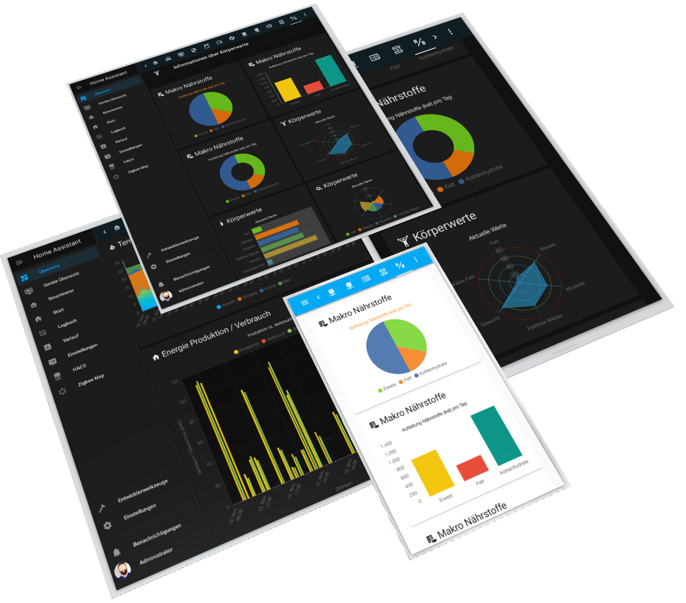

# Lovelace - graph-chartjs-card

<br>

This is higly customizable graph card for [Home-Assistant](https://www.home-assistant.io/)'s Lovelace UI.

Graph ChartJS Chart `Version 2.0.2` for Home Assistant -  Visualize your data in different ways- `BAR`, `HORIZONTALBAR` ,`SEGMENTEDBAR`, `PIE`, `DOUGHNUT`, `LINE`,`RADAR`,`SCATTR`,`BUBBLE` - ; each of them animated and customisable. Respects the set Homeassistant `locale` for numbers and dates.

It is based on [chart.js](https://chartjs.org) and offers most of the features of the library - datasource `home-assitant history` or `influx database queries`.

<br>




<br>
If you find any information on this page useful, feel free to buy me a coffee:
<a href="https://www.buymeacoff.ee/zibous" target="_blank"></a>

<hr>
<br>

## Installation

### Manual install

1. Download the [latest release](https://github.com/zibous/lovelace-graph-chart-card/releases), unzip and copy the folder `chart-card` into your `config/www/community` directory.
  <br>

2. Add a reference to `chart-card-min.js` inside your `ui-lovelace.yaml` or at the top of the *raw config editor UI*:

    ```yaml
    resources:
      - url: /hacsfiles/chart-card/chart-card-min.js
        type: module
    ```
    <br>

    You can see all the ways to use `Lovelace - graph-chartjs-card` in the [usage documentation](docs/getting-started/index.md).

    

    <br>

## YAML Structure for `custom:chart-card`

```yaml
## -------------------------------------
## all settings for a custom-chart-card
## -------------------------------------
- type: 'custom:chart-card'
  ## all for the card
  title: '{text: card-titel}'
  icon: '{text: card-title-icon}'
  height: {height-chard: number}px
  chart: '{chart-type: line|radar|bar|horizontalBar|pie|doughnut|polarArea|bubble|scatter}'
  ## optional settings for chart
  showstate: {boolean: true|false}
  debug: {boolean: true|false}
  cardtimestamp: {boolean: true|false}
  showdetails:
    title: '{text: titel}'
    title_sensor: '{text: table-header sensor}'
    title_mean: '{text: table-header mean value}'
    title_min: '{text: table-header min value}'
    title_max: '{text: table-header max value}'
    title_current: '{text: table-header current value}'
    title_timestamp: '{text: table-header timestamp}'
    visible: {boolean: true|false}
  loader: '{text: audio|ball-triangle|bars|circles|grid|hearts|'
           'oval|pfuff|rings|spinning-circles|tail-spin|three-dots}'
  update_interval: {integer: secunds}     
  
  ## otional settings for data scales (time-series)
  datascales:
    range: {integer}
    unit: '{text: second|minute|hour|day|month|year}'
    format: '{text: dateformat pattern}'
    factor: {number: factor}
    ignoreZero: {boolean: true|false}
    aggregate: '{text: first|last|sum|mean|max|min|range|midrange}'
    mode: '{text: category|time}'
    
  ## optional chart.js options (see chart.js documentation) 
  chartOptions:
    plugins:
      legend:
        position: '{text: top|right|left|bottom}'
        display: {boolean: true|false}
    scales:
      x:
        alignToPixels: {boolean: true|false}
        stacked: {boolean: true|false}
        offset: {boolean: true|false}
        title:
          display: {boolean: true|false}
          text: '{text: axis-title}'
      'y':
        alignToPixels: {boolean: true|false}
        stacked: {boolean: true|false}
        title:
          display: {boolean: true|false}
          text: '{text: axis-title}'
          
  entities:
    ## optional options for all entities
    - options:
      unit: '{text: unit-text}'
      ignoreZero: {boolean: true|false} 
      
    - entity: '{text: entity-id}'
      ## optional settings for the current entity (1st)
      name: '{text: display-text}'
      attribute: '{text: entity-attribute-name}'
      unit: '{text: unit-text}'
      ignoreZero: {boolean: true|false}
      aggregate: '{text: first|last|sum|mean|max|min}'
      style: ## see chart.js documentation
        backgroundColor: '{text: HEX|RGB|RGBA color}'
        
    - entity: '{text: entity-id}'
      ## optional settings for the current entity (2nd)
      name: '{text: display-text}'
      attribute: '{text: entity-attribute-name}'
      factor: {number: factor}
      aggregate: '{text: first|last|sum|mean|max|min}'
      style: ## see chart.js documentation
        backgroundColor: '{text: HEX|RGB|RGBA color}'
        
    ## optional influxdb datasource    
    - entity: '{text: entity-id}'
      dataid: '{text: unique id}'
      datasource:        
        influxdb: '{text: influxdb connection}'
        query: '{text: influxdb SQL statement}'
        token: '{text: btoa(user:passwort)}'        

```


For `chartOptions` and `entity.style`,   see: [Chart.js documentation](https://www.chartjs.org/docs/latest/)


## Creating a Chart

It's easy to get started with `Lovelace - graph-chartjs-card`. All that's required is the libraries included in your Home-assistant installation to render the charts.

In this example, we create a bar chart for a two dataset and render that in the lovelace page. 
[Data source](https://github.com/zibous/ha-miscale2), read weight measurements from Xiaomi Body Scales....


## 


 

### YAML Configuration

```yaml
- type: 'custom:chart-card'
  title: 'Makro Nährstoffe'
  icon: 'mdi:nutrition'
  chart: 'bar'
  chartOptions:
    plugins:
      title:
        display: true
        text: 'Aufteilung Nährstoffe (kal) pro Tag'
        color: '#ff9500'
  entities:
    - entity: sensor.eiweis_makronahrstoff
      name: Eiweis
    - entity: sensor.fett_makronahrstoff
      name: Fett
    - entity: sensor.kohlenhydrate_makronahrstoff
      name: Kohlenhydrate
```

You can see all the ways to use `Lovelace - graph-chartjs-card` in the [usage documentation](docs/getting-started/index.md).

<br>

## Helper

- [YAML to JSON Online](https://www.convertjson.com/yaml-to-json.htm) - Use this online tool to convert YAML into JSON. 
- [JSON to YAML Online](https://www.convertjson.com/json-to-yaml.htm) - Use this online tool to convert JSON into YAML. 

## Resources

- [Chart.js v3](https://chartjs.org) - Chart.js - Simple yet flexible JavaScript charting for designers & developers
- [Chart.js Official Guide](https://chartjs.org/docs) - The user guide and documentation site.
- [Chart.js Samples](https://www.chartjs.org/samples/latest/) - Simple yet flexible JavaScript charting for designers & developers
- [Colors with Chart.js & D3's](https://codenebula.io/javascript/frontend/dataviz/2019/04/18/automatically-generate-chart-colors-with-chart-js-d3s-color-scales/) - Automatically Generate Chart Colors with Chart.js & D3's Color Scales...
- [SVG Loaders](http://samherbert.net/svg-loaders/) - SVG-Loaders...
- [Colors Wall](https://colorswall.com) - Place to store your color Palettes
- [UI gradients](https://uigradients.com/) - uiGradients - Beautiful colored gradients


<hr>

## Credits

- [Evert Timberg](https://github.com/etimberg) - Maintainer of @chartjs

- [Jukka Kurkela](https://github.com/kurkle) - Maintainer of @chartjs & Plugins for chartjs

- [sdelliot](https://github.com/sdelliot/pie-chart-card) - Lovelace Pie Chart Card

- [cheelio](https://github.com/cheelio/power-usage-card) - Lovelace power usage graph card

  


## License

`graph-chartjs-card` is available under the [MIT license](https://opensource.org/licenses/MIT).