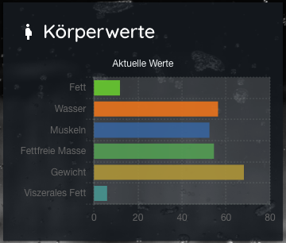
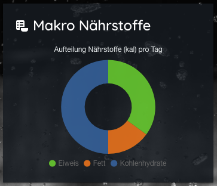
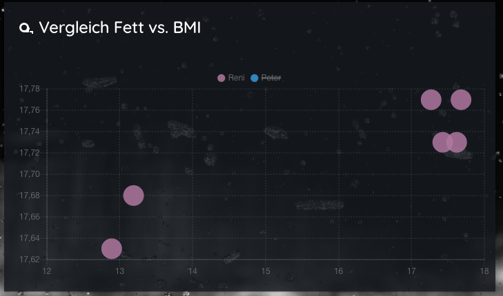

# Chart types & datasource

## Bar Chart vertical

### Data Structure

The `data` property of a dataset for a bar chart is specified as an array of numbers. Each point in the data array corresponds to the label at the same index on the x axis.

```javascript
data: [20, 10]
```

You can also specify the dataset as x/y coordinates when using the [time scale](https://www.chartjs.org/docs/latest/axes/cartesian/time.html#time-cartesian-axis).

```javascript
data: [{x:'2016-12-25', y:20}, {x:'2016-12-26', y:10}]
```


### Lovelace - Card Settings

```yaml
    ## --------------------------------
    ## chart: 'bar' simple
    ## --------------------------------
    - type: 'custom:chart-card'
    title: 'Makro Nährstoffe'
    icon: 'mdi:nutrition'
    height: 240
    chart: 'bar'
    units: 'kal'
    options:
        title:
        display: true
        text: 'Aufteilung Nährstoffe (kal) pro Tag'
    entities:
        - entity: sensor.peter_eiweis_makronahrstoff
          name: Eiweis
          backgroundColor: '#f1c40f'
        - entity: sensor.peter_fett_makronahrstoff
          name: Fett
          backgroundColor: '#e74c3c'
        - entity: sensor.peter_kohlenhydrate_makronahrstoff
          name: Kohlenhydrate
          backgroundColor: '#009688'
```

```javascript
var data = {
    labels: ['Eiweis', 'Fett', 'Kohlenhydrate'],
    datasets: [{
        label: 'Dataset 1',
        backgroundColor: ['#03a9f4', '#00bcd4', '#8bc34a'],
        borderWidth: 0,
        data: [869, 373, 1242]
    }]
}
```

## Bar Chart horizontal

The configuration options for the horizontal bar chart are the same as for the [bar chart](https://www.chartjs.org/docs/latest/charts/bar.html#scale-configuration). However, any options specified on the x axis in a bar chart, are applied to the y axis in a horizontal bar chart.



### Lovelace - Card Settings

```yaml
    ## --------------------------------
    ## chart: 'horizontalBar' 
    ## --------------------------------
    - type: 'custom:chart-card'
      title: 'Körperwerte'
      icon: 'mdi:human-pregnant'
      height: 240
      chart: 'horizontalBar'
      options:
        title:
        text: 'Aktuelle Werte'
        chartArea:
           backgroundColor: 'rgba(255,255,255,0.15)'
        entities:
          - entity: sensor.peter_koperfett
            name: Fett
          - entity: sensor.peter_korperwasser
            name: Wasser
          - entity: sensor.peter_muskeln
            name: Muskeln
          - entity: sensor.peter_fettfreie_korpermasse
            name: Fettfreie Masse
          - entity: sensor.peter_gewicht
            name: Gewicht
          - entity: sensor.peter_viszerales_fett
            name: Viszerales Fett
```

```javascript
var data = {
    labels: ['Fett', 'Wasser', 'Muskeln','Fettfreie Masse','Gewicht', "Vizerales Fett],
    datasets: [{
        label: 'Dataset 1',
        backgroundColor: ['#03a9f4', '#00bcd4', '#8bc34a'],
        borderWidth: 0,
        data: [12.34, 54.20, 51.20, 52.10, 68.40, 7.34]
    }]
}
```

## Bar Stacked
Bar charts can be configured into stacked bar charts by changing the settings on the X and Y axes to enable stacking. Stacked bar charts can be used to show how one data series is made up of a number of smaller pieces.


### Lovelace - Card Settings

```yaml
        ## --------------------------------
        ## chart: 'bar' stacked
        ## --------------------------------    
        - type: 'custom:chart-card'
          title: 'Änderungen Körperwerte'
          icon: 'mdi:tape-measure'
          height: 360
          hours_to_show: 400 
          chart: 'bar'
          options:
            title:
              text: 'Abweichungen zum Vortag'
            legend:
              position: 'top'
            scales:
              x:
                stacked: true
              y:
                stacked: true
        entities:
            - entity: sensor.peter_trend_fett
              name: Fett
            - entity: sensor.peter_trend_gewicht
              name: Gewicht
            - entity: sensor.peter_trend_muskeln
              name: Muskeln
            - entity: sensor.peter_trend_wasser
              name: Wasser

```


## Pie Chart

#### Data Structure

For a pie chart, datasets need to contain an array of data points.  The data points should be a number, Chart.js will total all of the  numbers and calculate the relative proportion of each.

You also need to specify an array of labels so that tooltips appear correctly.


### Lovelace - Card Settings

```yaml
    - type: 'custom:chart-card'
      title: 'Makro Nährstoffe'
      icon: 'mdi:nutrition'
      height: 240
      chart: 'pie'
      units: 'kal'
      options:
        title:
          display: true
          text: 'Aufteilung Nährstoffe (kal) pro Tag'
          font:
            color: '#ff9500'
      entities:
        - entity: sensor.peter_eiweis_makronahrstoff
          name: Eiweis
        - entity: sensor.peter_fett_makronahrstoff
          name: Fett
        - entity: sensor.peter_kohlenhydrate_makronahrstoff
          name: Kohlenhydrate
```

```javascript
data = {
    datasets: [{
        data: [10, 20, 30]
    }],

    // These labels appear in the legend and in the tooltips when hovering different arcs
    labels: [
        'Red',
        'Yellow',
        'Blue'
    ]
};
```


## Doughnut Chart
Doughnut charts are probably the most commonly used charts. They are divided into segments, the arc of each segment shows the proportional value of each piece of data.



### Lovelace - Card Settings

```yaml
    - type: 'custom:chart-card'
      title: 'Makro Nährstoffe'
      icon: 'mdi:nutrition'
      height: 240
      chart: 'doughnut'
      units: 'kal'
      options:
        title:
          display: true
          text: 'Aufteilung Nährstoffe (kal) pro Tag'
      entities:
        - entity: sensor.peter_eiweis_makronahrstoff
          name: Eiweis
        - entity: sensor.peter_fett_makronahrstoff
          name: Fett
        - entity: sensor.peter_kohlenhydrate_makronahrstoff
          name: Kohlenhydrate
```


## Line Chart

A line chart is a way of plotting data points on a line. Often, it is used to show trend data, or the comparison of two data sets.

## Data Structure

The `data` property of a dataset for a line chart can be passed in two formats.

```javascript
data: [20, 10]
```

When the `data` array is an array of numbers, the x axis is generally a [category](https://www.chartjs.org/docs/latest/axes/cartesian/category.html#category-cartesian-axis). The points are placed onto the axis using their position in the array. When a line chart is created with a category axis, the `labels` property of the data object must be specified.


### Lovelace - Card Settings

```yaml
        ## --------------------------------
        ## LINE CHART
        ## --------------------------------
      - type: 'custom:chart-card'
        title: 'Temperaturverlauf'
        icon: 'mdi:fire'
        height: 320
        chart: 'line'
        units: '°C'
        locale: 'de-DE'
        hours_to_show: 72
        group_by: 'hour'
        ignoreZero: true
        showstate: true
        options:
            title:
            display: true
            fontStyle: normal
            text: 'Temperatur der letzten 3 Tage'
        entities:
            - options:
                unit: '°C'
                borderWidth: 1
            - entity: sensor.temp_sensor_temperature_aussen
            fill: true
            gradient:
                colors:
                - '#03a9f4'
                - '#00bcd4'
                - '#8bc34a'
                - '#e51400'
                - '#cddc39'
                - '#ff9800'
                - '#ff5722'
            name: Aussen
            - entity: sensor.temp_sensor_temperature_eingang
            name: Eingang
            fill: true
            - entity: sensor.temp_sensor_temperature_kuche
            name: Küche
            fill: true
            - entity: sensor.temp_sensor_temperature_bad
            name: Bad
            fill: true
```

### Multi axis
With cartesian axes, it is possible to create multiple X and Y axes. To do so, you can add multiple configuration objects to the xAxes and yAxes properties. When adding new axes, it is important to ensure that you specify the type of the new axes as default types are not used in this case.

In the example below, we are creating two Y axes. We then use the yAxisID property to map the datasets to their correct axes.


<br>

see: https://www.chartjs.org/samples/latest/charts/line/multi-axis.html

### Lovelace - Card Settings

```yaml

    ## --------------------------------
    ## LINE CHART - Multi axis
    ## --------------------------------
    - type: 'custom:chart-card'
      title: 'Energie Produktion / Verbrauch'
      height: 540
      chart: 'line'
      units: 'kWh'
      icon: 'mdi:home'
      hours_to_show: 144
      group_by: 'hour'
      ignoreZero: true
      showstate: true
      showdetails:
        title: 'Daten Übersicht'
      options:
        title:
          text: 'Produktion vs. Verbrauch'
        legend:
          position: top
        chartArea:
          backgroundColor: 'rgba(0,0,0,0.5)'
        scales:
          x:
            time:
              unit: 'hour'
              locale: 'de-DE'
            ticks:
              autoSkip: true
              maxTicksLimit: 8
            scaleLabel:
              display: true
              labelString: 'Zeitraum'
          left:
            scaleLabel:
              display: true
              labelString: 'Verbrauch / Überschuss (kWh)'
          right:
            scaleLabel:
              display: true
              labelString: 'Produktion (kWh)'

      entities:
        - options:
            unit: 'kWh'
            borderWidth: 1
        - entity: sensor.energy_production
          name: Produktion
          unit: 'kWh'
          yAxisID: 'right'
          backgroundColor: '#f1c40f'
          borderColor: '#f1c40f'
          borderWidth: 1
          type: 'bar'
        - entity: sensor.energy_consumption
          name: Verbrauch
          unit: 'kWh'
          yAxisID: 'left'
          backgroundColor: '#e74c3c'
          borderColor: '#e74c3c'
          borderWidth: 0.5
        - entity: sensor.energy_notused
          name: Überschuss
          unit: 'kWh'
          yAxisID: 'left'
          backgroundColor: '#8bc34a'
          borderColor: '#8bc34a'
          borderWidth: 0.5
          type: 'bar'

```

## Polar area

#### Data Structure

For a polar area chart, datasets need to contain an array of data  points. The data points should be a number, Chart.js will total all of  the numbers and calculate the relative proportion of each.

You also need to specify an array of labels so that tooltips appear correctly for each slice.


### Lovelace - Card Settings

```yaml
        ## --------------------------------
        ## chart: 'polarArea'
        ## --------------------------------
      - type: 'custom:chart-card'
        title: 'Körperwerte'
        icon: 'mdi:tape-measure'
        height: 240
        chart: 'polarArea'
        options:
            title:
            text: 'Aktuelle Werte'
            scale:
            gridLines:
                color:
                - '#03a9f4'
                - '#00bcd4'
                - '#8bc34a'
                - '#e51400'
                - '#cddc39'
                - '#ff9800'
                - '#ff5722'
            angleLines:
                color: '#5ac8fa'
        entities:
            - entity: sensor.peter_koperfett
            name: Fett
            - entity: sensor.peter_korperwasser
            name: Wasser
            - entity: sensor.peter_muskeln
            name: Muskeln
            - entity: sensor.peter_fettfreie_korpermasse
            name: Fettfreie Masse
            - entity: sensor.peter_gewicht
            name: Gewicht
            - entity: sensor.peter_viszerales_fett
            name: Viszerales Fett
```

```javascript
data = {
    datasets: [{
        data: [10, 20, 30]
    }],

    // These labels appear in the legend and in the tooltips when hovering different arcs
    labels: [
        'Red',
        'Yellow',
        'Blue'
    ]
};
```

## Radar

#### Data Structure

The `data` property of a dataset for a radar chart is  specified as an array of numbers. Each point in the data array  corresponds to the label at the same index.

```javascript
data: [20, 10]
```

For a radar chart, to provide context of what each point means, we  include an array of strings that show around each point in the chart.


### Lovelace - Card Settings

```yaml
    ## --------------------------------
    ## chart: 'radar'
    ## --------------------------------
    - type: 'custom:chart-card'
      title: 'Körperwerte'
      icon: 'mdi:weight-lifter'
      height: 240
      chart: 'radar'
      options:
        title:
          text: 'Aktuelle Werte'
        scale:
          gridLines:
            color:
              - '#03a9f4'
              - '#00bcd4'
              - '#8bc34a'
              - '#e51400'
              - '#cddc39'
              - '#ff9800'
              - '#ff5722'
          angleLines:
            color: '#5ac8fa'
      entities:
        - entity: sensor.peter_koperfett
          name: Fett
        - entity: sensor.peter_korperwasser
          name: Wasser
        - entity: sensor.peter_muskeln
          name: Muskeln
        - entity: sensor.peter_fettfreie_korpermasse
          name: Fettfreie Masse
        - entity: sensor.peter_gewicht
          name: Gewicht
        - entity: sensor.peter_viszerales_fett
          name: Viszerales Fett

```


```javascript
data: {
    labels: ['Running', 'Swimming', 'Eating', 'Cycling'],
    datasets: [{
        data: [20, 10, 4, 2]
    }]
}
```

### Scatter

#### Data Structure

Unlike the line chart where data can be supplied in two different  formats, the scatter chart only accepts data in a point format.

```javascript
data: [{
        x: 10,
        y: 20
    }, {
        x: 15,
        y: 10
    }]
```



### Lovelace - Card Settings

```yaml
      ## --------------------------------
      ## chart: 'scatter'
      ## --------------------------------
      - type: 'custom:chart-card'
        title: 'Vergleich Fett vs. BMI'
        icon: 'mdi:tape-measure'
        height: 360
        hours_to_show: 400
        chart: 'scatter'
        options:
          legend:
            position: 'top'
        entities:
          ## first holds all options
          - entity: sensor.reni_koperfett ## x-axis
            name: 'Reni'
          - entity: sensor.reni_bmi ## y-axis
          ## first holds all options
          - entity: sensor.peter_koperfett ## x-axis
            name: 'Peter'
          - entity: sensor.peter_bmi ## y-axis

```

### Bubble Chart

#### Data Structure

Bubble chart datasets need to contain a `data` array of points, each points represented by an object containing the following properties:

```javascript
{
    // X Value
    x: number,

    // Y Value
    y: number,

    // Bubble radius in pixels (not scaled).
    r: number
}
```


### Lovelace - Card Settings

```yaml
      ## --------------------------------
      ## chart: 'bubble'
      ## --------------------------------
      - type: 'custom:chart-card'
        title: 'Körper-Typ'
        icon: 'mdi:tape-measure'
        height: 360
        hours_to_show: 400
        chart: 'bubble'
        options:
          title:
            text: 'Verhältnis BMI zu Muskeln/Fett'
          legend:
            position: 'top'
          chartArea:
            backgroundColor: 'rgba(0,0,255,0.05)'
          scales:
            x:
              min: 8
              max: 18
            y:
              min: 30
              max: 70
        entities:
          ## first bubble ---------------------------
          - entity: sensor.peter_koperfett ## x-axis
            name: Fett
            unit: '%'
          - entity: sensor.peter_muskeln ## y-axis
            name: Muskeln
            unit: '%'
          ## last holds all options for the bubble
          - entity: sensor.peter_bmi ## bubble
            name: BMI Peter
            unit: 'kg'
            backgroundColor: 'rgb(52,152,219)'

          ## next bubble ---------------------------
          - entity: sensor.reni_koperfett ## x-axis
            name: Fett
            unit: '%'
          - entity: sensor.reni_muskeln ## y-axis
            name: Muskeln
            unit: '%'
          ## last holds all options for the bubble
          - entity: sensor.reni_bmi ## bubble
            name: BMI Reni
            unit: 'kg'
            backgroundColor: 'rgb(255,152,219)'

```

**Important:** the radius property, `r` is **not** scaled by the chart, it is the raw radius in pixels of the bubble that is drawn on the canvas.


## Combo Bar Line Chart


### Lovelace - Card Settings

```yaml
      ## --------------------------------
      ## MIXED CHART (LINE & BAR)
      ## --------------------------------
      - type: 'custom:chart-card'
        title: 'Gewichtsverlauf'
        icon: 'mdi:scale'
        height: 320
        chart: 'line'
        locale: 'de-DE'
        hours_to_show: 400 ## last 8 days..
        group_by: 'day'
        showstate: true
        options:
          legend:
            position: 'top'
          scales:
            x:
              scaleLabel:
                display: true
                labelString: 'Zeitraum'
            left:
              scaleLabel:
                display: true
                labelString: 'Gewicht / Muskeln'
              ticks:
                autoSkip: true
                maxTicksLimit: 12
            right:
              scaleLabel:
                display: true
                labelString: 'BMI'
              gridLines:
                drawOnChartArea: false
              ticks:
                autoSkip: true
                maxTicksLimit: 16
        entities:
          - entity: sensor.peter_muskeln
            yAxisID: 'left'
            type: 'line'
          - entity: sensor.peter_gewicht
            yAxisID: 'left'
            type: 'line'
          - entity: sensor.peter_bmi
            yAxisID: 'right'
            type: 'bar'
            fill: true
            gradient:
              colors:
                - '#ff9500'
                - '#ff5722'
                - '#e74c3c'

```

see: https://www.chartjs.org/samples/latest/charts/combo-bar-line.html

<hr>

## Additional Info

### Basic
see: https://www.chartjs.org/samples/latest/charts/line/basic.html


### Stepped

```javascript
    steppedLine: false      ## 'No Step Interpolation',
    steppedLine: true       ## 'Step Before Interpolation'
    steppedLine: 'before'   ## 'Step Before Interpolation'
    steppedLine: 'after'    ## 'Step After Interpolation'
    steppedLine: 'middle'   ## 'Step Middle Interpolation'
```

```javascript
datasets: [{
    label: 'steppedLine: ' + details.steppedLine,
    steppedLine: **steppedLine**,
    data: data,
    borderColor: details.color,
    fill: false,
}]
```

see: https://www.chartjs.org/samples/latest/charts/line/stepped.html

### Interpolation

```javascript
    datasets: [{
        label: 'Cubic interpolation (monotone)',
        data: datapoints,
        borderColor:'red',
        backgroundColor: 'rgba(0, 0, 0, 0)',
        fill: false,

        cubicInterpolationMode: 'monotone'  ##!!!

    }, {
        label: 'Cubic interpolation (default)',
        data: datapoints,
        borderColor: 'blue',
        backgroundColor: 'rgba(0, 0, 0, 0)',
        fill: false,

    }, {
        label: 'Linear interpolation',
        data: datapoints,
        borderColor: 'green',
        backgroundColor: 'rgba(0, 0, 0, 0)',
        fill: false,

        lineTension: 0  ##!!!

    }]
```

see: https://www.chartjs.org/samples/latest/charts/line/interpolation-modes.html


<hr>

## Datasource

| Type  | Simple Data      | Series Data      |  Remarks   |
| ----  | ----             | ----             |---- |
| bar   |  [869, 373, 1242]    |   [{869, 373, 1242},{869, 373, 1242}]   |    |
| bar horizontal    |  [869, 373, 1242]    |   [{869, 373, 1242},{869, 373, 1242}]   |    |
| pie     |  [[869, 373, 1242]    |   [{869, 373, 1242},{869, 373, 1242}]   |    |
| doughnut     |  [[869, 373, 1242]    |   [{869, 373, 1242},{869, 373, 1242}]   |    |
| line     |  [869, 373, 1242]    | ---   |   |
| lines     |  [{869, 373, 1242},{869, 373, 1242}]    | --- |  |
| ----  | ----             | ----             | |
