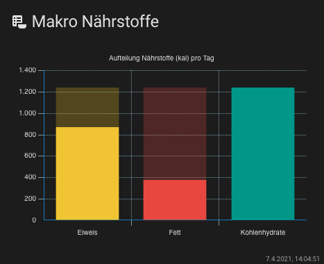
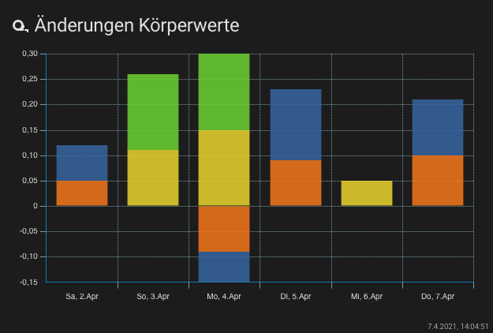

# Lovelace - graph-chartjs-card
<br>

## Bar charts

A bar chart provides a way of showing data values represented as vertical bars, is sometimes used to show trend data, and the comparison of  multiple data sets side by side.

### Minimal Bar chart


<br>

#### Example

```yaml
- type: 'custom:chart-card'
  title: Stromkosten der Geschosse
  icon: 'mdi:counter'
  chart: bar
  entities:
    - entity: sensor.0_eg
    - entity: sensor.1_og
    - entity: sensor.2_og
    - entity: sensor.3_og
```
<br>

### Advanced - Bar Chart (segmented)


<br>

#### Example

```yaml
 - type: 'custom:chart-card'
   title: 'Makro Nährstoffe'
   icon: 'mdi:nutrition'
   chart: 'bar'
   height: 320
   chartOptions:
     segmented: true
   plugins:
     title:
      display: true
      text: 'Aufteilung Nährstoffe (kal) pro Tag'
   entities:
     - options:
       unit: 'kal'
     - entity: sensor.peter_eiweis_makronahrstoff
       name: Eiweis
      style:
        backgroundColor: '#f1c40f'
     - entity: sensor.peter_fett_makronahrstoff
       name: Fett
       style:
         backgroundColor: '#e74c3c'
     - entity: sensor.peter_kohlenhydrate_makronahrstoff
       name: Kohlenhydrate
       style:
         backgroundColor: '#009688'
```


<br>

### Advanced - Bar Timeseries Chart 


<br>

#### Example

```yaml
- type: 'custom:chart-card'
  title: Energieproduktion Photovoltaik
  icon: 'mdi:counter'
  height: 360
  chart: bar
  showstate: false
  update_interval: 30
  debug: true
  datascales:
    range: 24
    unit: hour
    mode: time
  chartOptions:
    plugins:
      legend:
        display: false
    scales:
      x:
        alignToPixels: true
        stacked: true
      'y':
        stacked: true
  entities:
    - entity: sensor.solarpower_current_power
      name: Energieproduktion
      unit: kWh
      ignoreZero: true
      factor: 0.001
      aggregate: max
      style:
        backgroundColor: '#fcec34'

```
<br>

### Advanced - Bar Timeseries Chart stacked

Bar charts can be configured into stacked bar charts by changing the settings on the X and Y axes to enable stacking. Stacked bar charts can be used to show how one data series is made up of a number of smaller pieces.


<br>

#### Example

```yaml
- type: 'custom:chart-card'
  title: Verbrauch vs. Produktion
  icon: 'mdi:counter'
  height: 480
  chart: bar
  showstate: false
  debug: true
  datascales:
    range: 288
    unit: day
    format: 'ddd, dd.mmmm'
  chartOptions:
    plugins:
      legend:
        position: top
        display: true
    scales:
      x:
        alignToPixels: true
        stacked: true
        offset: true
        title:
          display: true
          text: Zeitraum
      'y':
        alignToPixels: true
        stacked: true
        title:
          display: true
          text: Energie kWh
  entities:
    - entity: sensor.verbrauch_gesamt
      name: Verbrauch
      attribute: sum_hour
      unit: kWh
      ignoreZero: false
      aggregate: sum
      style:
        backgroundColor: '#FF8066'
    - entity: sensor.solarpower_current_power
      name: Energieproduktion
      attribute: power_hour
      unit: kWh
      ignoreZero: true
      factor: 0.001
      aggregate: sum
      style:
        backgroundColor: '#fcec34'
```
<br>

### Advanced - Bar Timeseries Chart stacked 


<br>

#### Example

```yaml
  - type: 'custom:chart-card'
    title: 'Änderungen Körperwerte'
    icon: 'mdi:tape-measure'
    height: 360
    datascales:
      range: 120
      unit: day
    chart: 'bar'
    chartOptions:
      plugins:
        title:
          text: 'Abweichungen zum Vortag'
        legend:
          position: top
      scales:
        x:
          stacked: true
        y:
          stacked: true
    entities:
      - entity: sensor.peter_trend_fett
        name: Fett
        aggregate: max
      - entity: sensor.peter_trend_gewicht
        name: Gewicht
        aggregate: max
      - entity: sensor.peter_trend_muskeln
        name: Muskeln
        aggregate: max
      - entity: sensor.peter_trend_wasser
        name: Wasser
        aggregate: max
```

<hr>

**Chart Options `chartOptions`**
see: https://www.chartjs.org/docs/latest/charts/bar.html#dataset-properties

