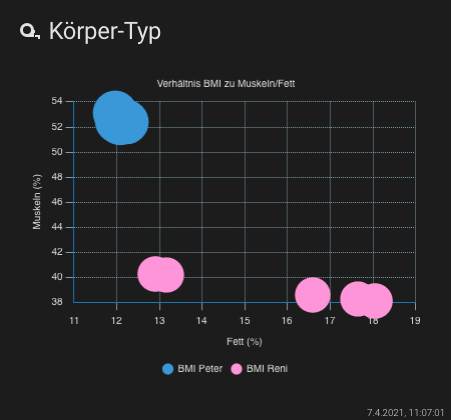

## Lovelace - graph-chartjs-card
### Bubble Charts

A bubble chart is used to display three dimensions of data at the same time. The location of the bubble is determined by the first two dimensions and the corresponding horizontal and vertical axes. The third dimension is represented by the size of the individual bubbles.


#### Minimal Bubble Chart


<br>

### Example

```yaml
- type: 'custom:chart-card'
  title: Körper-Typ
  icon: 'mdi:tape-measure'
  chart: bubble
  entities:
    - entity: sensor.peter_koperfett   ## x-axis
    - entity: sensor.peter_muskeln     ## y-axis
    - entity: sensor.peter_bmi         ## bubble
    - entity: sensor.reni_koperfett    ## x-axis
    - entity: sensor.reni_muskeln      ## y-axis
    - entity: sensor.reni_bmi          ## bubble 
```

<br>

### Advanced Bubble Chart



<br>

### Example

```yaml
- type: 'custom:chart-card'
  title: Körper-Typ
  icon: 'mdi:tape-measure'
  height: 360
  datascales:
    range: 120
    unit: day
  chart: bubble
  chartOptions:
    plugins:
      title:
        text: Verhältnis BMI zu Muskeln/Fett
        display: true
      legend:
        position: bottom
        display: true
      scales:
        x:
          min: 8
          max: 18
        y:
          min: 30
          max: 70
  entities:
    - entity: sensor.peter_koperfett
      name: Fett
      unit: '%'
    - entity: sensor.peter_muskeln
      name: Muskeln
      unit: '%'
    - entity: sensor.peter_bmi
      name: BMI Peter
      scale: 0.5
      unit: kg
      style:
        backgroundColor: 'rgb(52,152,219)'
    - entity: sensor.reni_koperfett
      name: Fett
      unit: '%'
    - entity: sensor.reni_muskeln
      name: Muskeln
      unit: '%'
    - entity: sensor.reni_bmi
      name: BMI Reni
      scale: 0.5
      unit: kg
      style:
        backgroundColor: 'rgb(255,152,219)'
```

<hr>
**Chart Options `chartOptions`**

see: https://www.chartjs.org/docs/latest/charts/bubble.html#dataset-properties

