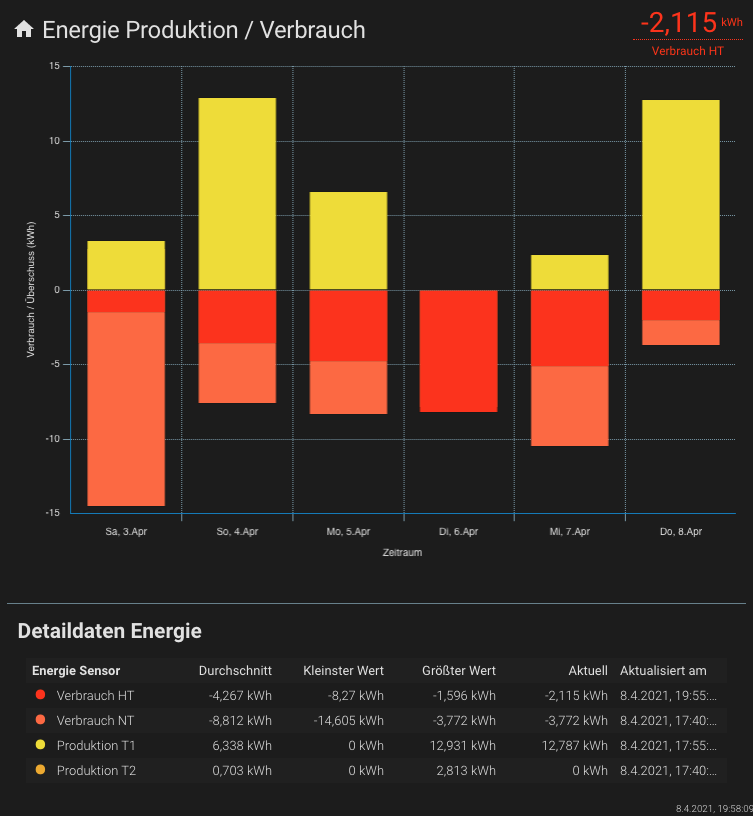

# Lovelace - graph-chartjs-card
## Chart Detaildata




<br>

### Example

```yaml
- type: 'custom:chart-card'
  title: Energie Produktion / Verbrauch
  height: 540
  chart: bar
  units: kWh
  icon: 'mdi:home'
  debug: true
  datascales:
    range: 288
    unit: day
    aggregate: last
    ignoreZero: true
  showstate: true
  ## -----------------------------
  ## CHART DETAIL DATA SECTION
  ## -----------------------------
  showdetails:
    title: Detaildaten Energie
    title_sensor: Energie Sensor
    title_mean: Durchschnitt
    title_min: Kleinster Wert
    title_max: Größter Wert
    title_current: Aktuell
    title_timestamp: Aktualisiert am
    visible: true
  ## -----------------------------  
  chartOptions:
    plugins:
      title:
        text: Produktion vs. Verbrauch
      legend:
        position: top
    scales:
      x:
        stacked: true
        title:
          display: true
          text: Zeitraum
      'y':
        title:
          display: true
          text: Verbrauch / Überschuss (kWh)
  entities:
    - options:
        unit: kWh
        borderWidth: 1
    - entity: sensor.energy_consumption_day_ht
      name: Verbrauch HT
      factor: -1
      style:
        backgroundColor: 'rgb(251, 60, 11)'
    - entity: sensor.energy_consumption_day_nt
      name: Verbrauch NT
      factor: -1
      style:
        backgroundColor: 'rgb(252, 108, 60)'
    - entity: sensor.energy_production_day_t1
      name: Produktion T1
      unit: kWh
      factor: 1
      style:
        backgroundColor: '#f0dc15'
    - entity: sensor.energy_production_day_t2
      name: Produktion T2
      unit: kWh
      factor: 1
      style:
        backgroundColor: 'rgb(237, 170, 24)'

```
<br>

<hr>

