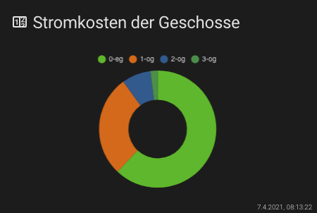

# Lovelace - graph-chartjs-card
<br>

## Doughnut Charts

Doughnut charts are probably the most commonly used charts. They are divided into segments, the arc of each segment shows the proportional value of each piece of data.

### Minimal Doughnut Chart


<br>

#### Example

```yaml
- type: 'custom:chart-card'
  title: Stromkosten der Geschosse
  icon: 'mdi:counter'
  chart: 'doughnut'
  entities:
    - entity: sensor.0_eg
    - entity: sensor.1_og
    - entity: sensor.2_og
    - entity: sensor.3_og
```
<br>

### Advanced Doughnut Chart


<br>

#### Example

```yaml
- type: 'custom:chart-card'
  title: Makro Nährstoffe
  icon: 'mdi:nutrition'
  height: 320
  chart: doughnut
  chartOptions:
    plugins:
      legend:
        position: bottom
      title:
        display: true
        text: Aufteilung Nährstoffe (kal) pro Tag
  entities:
    - options: null
      unit: '%'
    - entity: sensor.peter_eiweis_makronahrstoff
      name: Eiweis
      style:
        backgroundColor: '#f1c40f'
    - entity: sensor.peter_fett_makronahrstoff
      name: Fett
      style:
        backgroundColor: '#e74c3c'
    - entity: sensor.peter_kohlenhydrate_makronahrstoff
      name: Kohlenhydrate
      style:
        backgroundColor: '#009688'
```
<hr>


**Chart Options `chartOptions`**

see: https://www.chartjs.org/docs/latest/charts/doughnut.html#dataset-properties


