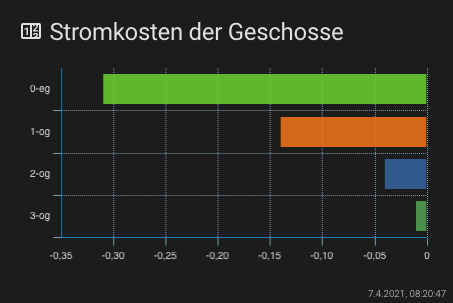
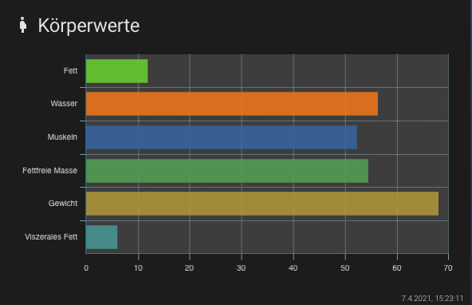

# Lovelace - graph-chartjs-card
<br>

## Horizontal Bar Charts

A horizontal bar chart is a variation on a vertical bar chart. It is sometimes used to show trend data, and the comparison of multiple data sets side by side. To achieve this you will have to set the `chart` property to `horizontalBar` and thus will show vertical bars.

### Minimal Horizontal Bar Chart


<br>

#### Example

```yaml
- type: 'custom:chart-card'
  title: Stromkosten der Geschosse
  icon: 'mdi:counter'
  chart: horizontalBar
  entities:
    - entity: sensor.0_eg
    - entity: sensor.1_og
    - entity: sensor.2_og
    - entity: sensor.3_og
```
<br>

### Advanced Horizontal Bar Chart
<br>

#### Example

```yaml
- type: 'custom:chart-card'
  title: Körperwerte
  icon: 'mdi:human-pregnant'
  height: 320
  chart: horizontalBar
  chartOptions:
    chartArea:
      backgroundColor: 'rgba(255,255,255,0.15)'
  entities:
    - entity: sensor.peter_koperfett
      name: Fett
    - entity: sensor.peter_korperwasser
      name: Wasser
    - entity: sensor.peter_muskeln
      name: Muskeln
    - entity: sensor.peter_fettfreie_korpermasse
      name: Fettfreie Masse
    - entity: sensor.peter_gewicht
      name: Gewicht
      style:
        gradient:
          colors:
            - '#03a9f4'
            - '#00bcd4'
            - '#8bc34a'
    - entity: sensor.peter_viszerales_fett
      name: Viszerales Fett
```

<hr>

**Chart Options `chartOptions`**
see: https://www.chartjs.org/docs/latest/charts/bar.html#horizontal-bar-chart


