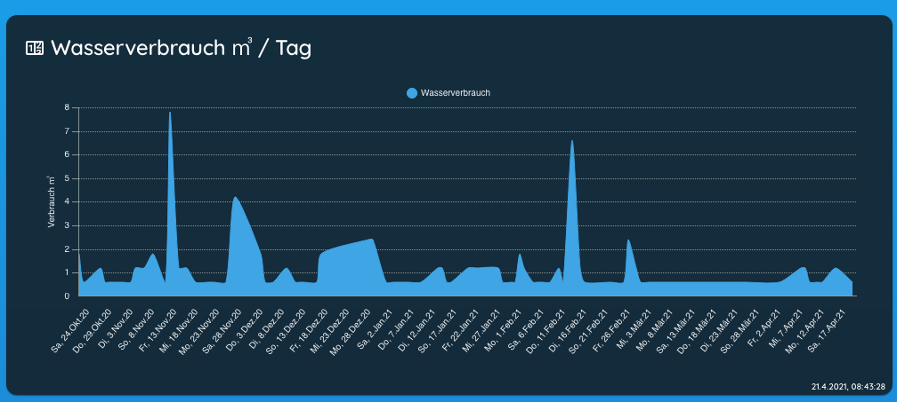
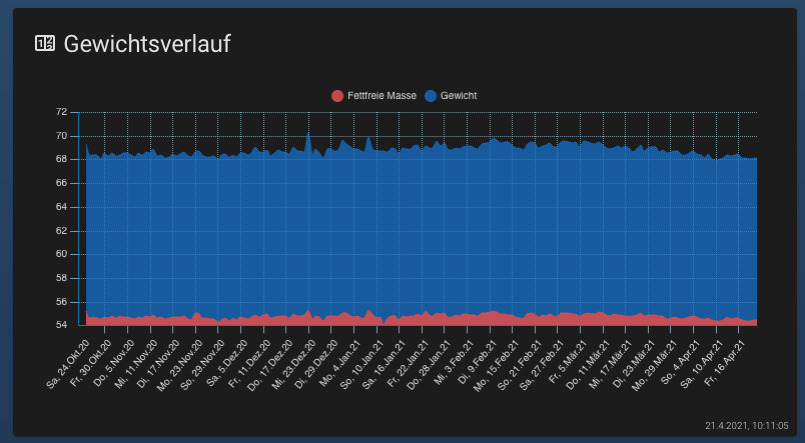
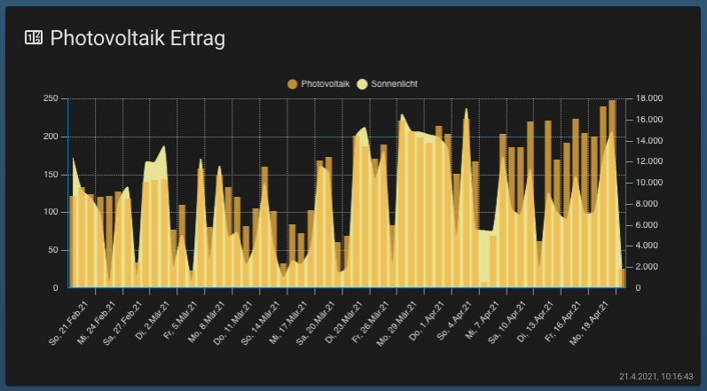

# Lovelace - graph-chartjs-card

<br>

## Line Chart with datasource`influxdb`

Another possibility is to determine the data not from the home assistant history but from an influx database. This is the most efficient method to display a lot of data from a time range.



<br>


> **Recommendation**
>
> The `sensor.datetime` can be used as a "joker" entity. `dateid` must be unique, because this is used for intentifying the settings. Except for datasource (describes the data retrieval), all other settings are the same as for the other data sources.
>
> Get the token form the Browsers Console: **btoa**(`${username}:${password}`). btoa creates a base-64 encoded ASCII string from a "string".

<br>

### Example Line chart

```yaml
- type: 'custom:chart-card'
  title: Wasserverbrauch ㎥ / Tag
  icon: 'mdi:counter'
  height: 360
  chart: line
  debug: true
  datascales:
    mode: time
  chartOptions:
    plugins:
      legend:
        position: top
        display: true
    scales:
      x:
        grid:
          display: false
      'y':
        suggestedMin: 0
        suggestedMax: 8
        grid:
          display: true
        title:
          display: true
          text: Verbrauch ㎥
  entities:
    - entity: sensor.date_time
      dataid: wasser
      unit: ㎥
      datasource:
        influxdb: >-
          https://influxdb.local/query?db=home_assistant&epoch=ms
        query: >-
          SELECT sum("value") FROM "㎥" 
          WHERE ("entity_id" ='max_m3_day') 
          AND time > now() -180d 
          GROUP BY time(1d) fill(null)
        token: YWRtdWadAYmVlcDRCb3Nz
      name: Wasserverbrauch
      style:
        backgroundColor: '#3aa5e7'
        fill: true
        borderWidth: 1
        order: 1
```

<br>



<br>

```yaml
- type: 'custom:chart-card'
  title: Gewichtsverlauf
  icon: 'mdi:counter'
  height: 360
  chart: line
  debug: true
  datascales:
    mode: time
  chartOptions:
    plugins:
      legend:
        position: top
        display: true
      scales:
        'y':
          title:
            display: true
            text: kg
  entities:
    - entity: sensor.date_time
      dataid: gewicht
      unit: kg
      datasource:
        influxdb: >-
          https://influxdb.local/query?db=historydata&epoch=ms
        query: >-
          SELECT mean("weight") FROM "miscale_peter" 
          WHERE time > now() -180d 
          GROUP BY time(1d) fill(null)
        token: YWRtdWaDaYmVlcDRCb3Nz
      name: Gewicht
      style:
        backgroundColor: 'rgba(2, 117, 216,0.70)'
        fill: true
        borderWidth: 1
        order: 1
    - entity: sensor.date_time
      dataid: fettmasse
      datasource:
        influxdb: >-
          https://influxdb.local/query?db=historydata&epoch=ms
        query: >-
          SELECT mean("lbm") FROM "miscale_peter" 
          WHERE time > now() -180d 
          GROUP BY time(1d)  fill(null)
        token: YWRtdWaDaYmVlcDRCb3Nz
      name: Fettfreie Masse
      unit: kg
      style:
        backgroundColor: 'rgba(217, 83, 79, 0.90)'
        fill: true
        borderWidth: 1
        order: 0

```

<br>



<br>

```yaml
- type: 'custom:chart-card'
  title: Photovoltaik Ertrag
  icon: 'mdi:counter'
  height: 360
  chart: bar
  debug: true
  datascales:
    mode: time
  chartOptions:
    plugins:
      legend:
        position: top
        display: true
      scales:
        x:
          title:
            display: true
            text: Solar-Energie
        left:
          title:
            display: true
            text: kWh
        right:
          title:
            display: true
            text: Lux
          gridLines:
            drawOnChartArea: false
  entities:
    - entity: sensor.date_time
      dataid: kostalWh
      unit: kWh
      datasource:
        influxdb: >-
          https://influxdb.local/query?db=home_assistant&epoch=ms
        query: >-
          SELECT sum("value")*0.001 FROM "Wh" 
          WHERE ("entity_id" = 'kostal_watt_aktuell') 
          AND time > now() -60d GROUP BY time(1d) fill(null)
        token: YWRtdWaDaYmVlcDRCb3Nz
      name: Photovoltaik
      style:
        yAxisID: left
        backgroundColor: 'rgb(243, 180, 53,0.75)'
    - entity: sensor.date_time
      dataid: lux
      datasource:
        influxdb: >-
          https://influxdb.local/query?db=home_assistant&epoch=ms
        query: >-
          SELECT mean("value") FROM "Lux" 
          WHERE time > now() -60d 
          GROUP BY time(1d) fill(null)
        token: YWRtdWaDaYmVlcDRCb3Nz
      name: Sonnenlicht
      unit: Lux
      style:
        type: line
        yAxisID: right
        backgroundColor: 'rgba(233, 227, 144)'
        fill: true
        borderWidth: 1
```

<br>

<hr>


