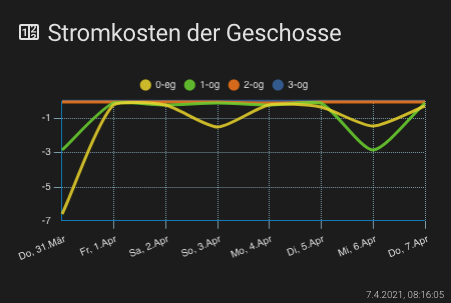
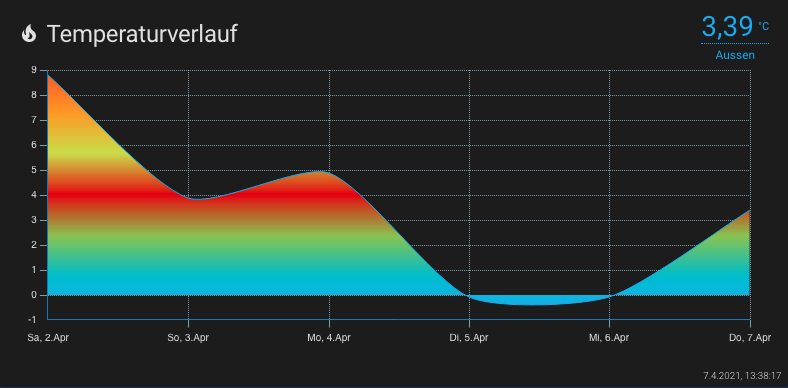

## Lovelace - graph-chartjs-card
### Line Charts

A line chart is a way of plotting data points on a line. Often, it is used to show trend data, or the comparison of two data sets.

#### Minimal Line Chart


<br>

```yaml
- type: 'custom:chart-card'
  title: Stromkosten der Geschosse
  icon: 'mdi:counter'
  chart: 'line'
  entities:
    - entity: sensor.0_eg
    - entity: sensor.1_og
    - entity: sensor.2_og
    - entity: sensor.3_og
```
<br>

### Advanced Line Chart stacked (Area Chart)


<br>

```yaml
- type: 'custom:chart-card'
  title: Stromverbrauch der Geschosse
  icon: 'mdi:counter'
  height: 360
  chart: line
  chartOptions:
    plugins:
      legend:
        position: top
        display: true
    scales:
      x:
        alignToPixels: true
      y:
        stacked: true
  entities:
    - entity: sensor.1_og
      name: Wohngeschoss
      attribute: sum_hour
      unit: kWh
      factor: -1
      style:
        fill: true
        backgroundColor: '#2196f3'
    - entity: sensor.2_og
      name: Obgeschoss
      attribute: sum_hour
      unit: kWh
      factor: -1
      style:
        fill: true
        backgroundColor: '#b968c7'
    - entity: sensor.3_og
      name: Dachgeschoss
      attribute: sum_hour
      unit: kWh
      factor: -1
      style:
        fill: true
        backgroundColor: '#009788'
```
<br>

### Advanced Line Chart with `datascales`: default


<br>

```yaml
- type: 'custom:chart-card'
  title: Temperaturverlauf
  icon: 'mdi:fire'
  height: 320
  chart: line
  showstate: true
  chartOptions:
    plugins:
      legend:
        display: false
  entities:
    - options:
        unit: °C
        borderWidth: 1
    - entity: sensor.temp_sensor_temperature_aussen
      name: Aussen
      style:
        fill: true
        gradient:
          colors:
            - '#03a9f4'
            - '#00bcd4'
            - '#8bc34a'
            - '#e51400'
            - '#cddc39'
            - '#ff9800'
            - '#ff5722'

```
<br>

### Advanced Line Chart with `datascales`: minute


<br>

```yaml
- type: 'custom:chart-card'
  title: Temperaturverlauf
  icon: 'mdi:fire'
  height: 320
  chart: line
  showstate: true
  debug: true
  datascales:
    range: 24
    unit: minute
  chartOptions:
    plugins:
      legend:
        display: false
      title:
        display: true
        fontStyle: normal
        text: Temperatur der letzten 24h
  entities:
    - options:
        unit: °C
        borderWidth: 1
    - entity: sensor.temp_sensor_temperature_aussen
      name: Aussen
      style:
        fill: true
        gradient:
          colors:
            - '#03a9f4'
            - '#00bcd4'
            - '#8bc34a'
            - '#e51400'
            - '#cddc39'
            - '#ff9800'
            - '#ff5722'

```
<br>


### Advanced Line Chart with 4 entities (`datascales`: default)


```yaml
- type: 'custom:chart-card'
  title: Temperaturverlauf
  icon: 'mdi:fire'
  height: 320
  chart: line
  showstate: true
  entities:
    - options:
        unit: °C
        borderWidth: 1
    - entity: sensor.temp_sensor_temperature_aussen
      name: Aussen
      style:
        fill: true
        gradient:
          colors:
            - '#03a9f4'
            - '#00bcd4'
            - '#8bc34a'
            - '#e51400'
            - '#cddc39'
            - '#ff9800'
            - '#ff5722'
    - entity: sensor.temp_sensor_temperature_eingang
      name: Eingang
      ignoreZero: true
      style:
        fill: true
    - entity: sensor.temp_sensor_temperature_kuche
      name: Küche
      ignoreZero: true
      style:
        fill: true
    - entity: sensor.temp_sensor_temperature_bad
      name: Bad
      ignoreZero: true
      style:
        fill: true

```

<hr>
##Chart Options `chartOptions`
see: https://www.chartjs.org/docs/latest/charts/line.html#dataset-properties