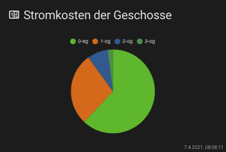

## Lovelace - graph-chartjs-card
### PIE Charts

Pie charts are probably the most commonly used charts. They are divided into segments, the arc of each segment shows the proportional value of each piece of data.

#### Minimal Pie Chart


<br>

### Example

```yaml
- type: 'custom:chart-card'
  title: Stromkosten der Geschosse
  icon: 'mdi:counter'
  chart: 'pie'
  entities:
    - entity: sensor.0_eg
    - entity: sensor.1_og
    - entity: sensor.2_og
    - entity: sensor.3_og
```
<br>

#### Advanced Pie Chart


<br>

### Example

```yaml
- type: 'custom:chart-card'
  title: 'Makro Nährstoffe'
  icon: 'mdi:nutrition'
  height: 320
  chart: 'pie'
  chartOptions:
    plugins:
      title:
        display: true
        text: 'Aufteilung Nährstoffe (kal) pro Tag'
        color: '#ff9500'
  entities:
    - entity: sensor.peter_eiweis_makronahrstoff
      name: Eiweis
    - entity: sensor.peter_fett_makronahrstoff
      name: Fett
    - entity: sensor.peter_kohlenhydrate_makronahrstoff
      name: Kohlenhydrate
```
<hr>


**Chart Options `chartOptions`**

see: https://www.chartjs.org/docs/latest/charts/doughnut.html#dataset-properties

