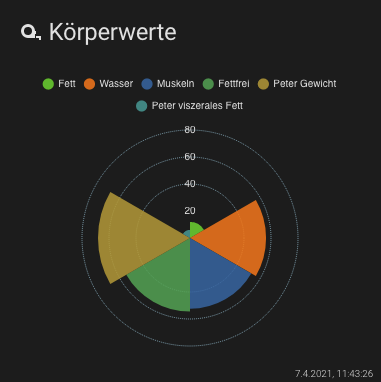
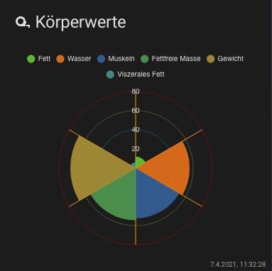

# Lovelace - graph-chartjs-card
## Polar Area Charts

Polar area charts are similar to pie charts, but each segment has the same angle - the radius of the segment differs depending on the value.
This type of chart is often useful when we want to show a comparison data similar to a pie chart, but also show a scale of values for context.


### Minimal Polar Area Chart


<br>

#### Example

```yaml
- type: 'custom:chart-card'
  title: Körperwerte
  icon: 'mdi:tape-measure'
  chart: polarArea
  entities:
    - entity: sensor.peter_koperfett
    - entity: sensor.peter_korperwasser
    - entity: sensor.peter_muskeln
    - entity: sensor.peter_fettfreie_korpermasse
    - entity: sensor.peter_gewicht
    - entity: sensor.peter_viszerales_fett
```
<br>


### Advanced Polar Area Chart


<br>

#### Example

```yaml
- type: 'custom:chart-card'
  title: Körperwerte
  icon: 'mdi:tape-measure'
  height: 320
  chart: polarArea
  chartOptions:
    plugins:
      title:
        text: Aktuelle Werte
    scales:
      r:
        grid:
          color:
            - '#03a9f4'
            - '#00bcd4'
            - '#8bc34a'
            - '#e51400'
            - '#cddc39'
            - '#ff9800'
            - '#ff5722'
        angleLines:
          display: true
          color: '#ff9800'
  entities:
    - entity: sensor.peter_koperfett
      name: Fett
    - entity: sensor.peter_korperwasser
      name: Wasser
    - entity: sensor.peter_muskeln
      name: Muskeln
    - entity: sensor.peter_fettfreie_korpermasse
      name: Fettfreie Masse
    - entity: sensor.peter_gewicht
      name: Gewicht
    - entity: sensor.peter_viszerales_fett
      name: Viszerales Fett  
```
<br>

<hr>


**Chart Options `chartOptions`**
see: https://www.chartjs.org/docs/latest/charts/polar.html#dataset-properties