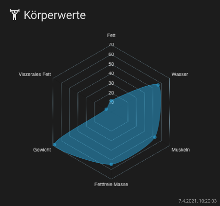

## Lovelace - graph-chartjs-card
### Radar Chart

A radar chart is a way of showing multiple data points and the variation between them. They are often useful for comparing the points of two or more different data sets.

#### Minimal Radar Chart


<br>

### Example

```yaml
- type: 'custom:chart-card'
  title: Körperwerte
  icon: 'mdi:weight-lifter'
  chart: radar
  entities:
    - entity: sensor.peter_koperfett
    - entity: sensor.peter_korperwasser
    - entity: sensor.peter_muskeln
    - entity: sensor.peter_fettfreie_korpermasse
    - entity: sensor.peter_gewicht
    - entity: sensor.peter_viszerales_fett
```
<br>

<hr>


**Chart Options `chartOptions`**

see: https://www.chartjs.org/docs/latest/charts/radar.html#dataset-properties