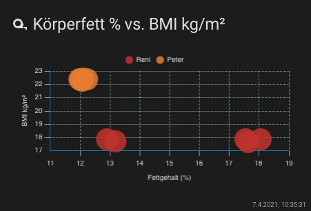

# Lovelace - graph-chartjs-card
## Scatter Charts

Scatter charts are based on basic line charts with the x axis changed to a linear axis. To use a scatter chart, data must be passed as objects containing X and Y properties. The example below creates a scatter chart with 4 points.

### Minimal Scatter Chart


<br>

#### Example

```yaml
- type: 'custom:chart-card'
  title: Körperwerte
  icon: 'mdi:weight-lifter'
  chart: radar
  entities:
    - entity: sensor.peter_koperfett
    - entity: sensor.peter_korperwasser
    - entity: sensor.peter_muskeln
    - entity: sensor.peter_fettfreie_korpermasse
    - entity: sensor.peter_gewicht
    - entity: sensor.peter_viszerales_fett
```
<br>

### Advanced Scatter Chart


<br>

#### Example

```yaml
- type: 'custom:chart-card'
  title: 'Körperfett % vs. BMI kg/m²'
  icon: 'mdi:tape-measure'
  datascales:
    range: 120
    unit: day
  chart: 'scatter'
  chartOptions:
    plugins:
      legend:
        position: top
        display: true
    scales:
      x:
        title:
          display: true
          text: 'Fettgehalt (%)'
      y:
        title:
          display: true
          text: 'BMI kg/m²'
  entities:
    - entity: sensor.reni_koperfett ## x-axis
      name: 'Reni'
      aggregate: max
    - entity: sensor.reni_bmi ## y-axis
      aggregate: max
    
    - entity: sensor.peter_koperfett ## x-axis
      name: 'Peter'
      aggregate: max
    - entity: sensor.peter_bmi ## y-axis
      aggregate: max

```
<br>

<hr>


**Chart Options `chartOptions`**
see: https://www.chartjs.org/docs/latest/charts/scatter.html#dataset-properties


