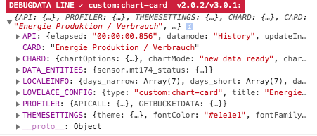

# Lovelace - graph-chartjs-card


## Developer Debug- & Profiledata

<br>

Developer debug & profile data are activated if `debug: true` is entered in the configuration. This information is then displayed in the browser's debugging console.

<br>



<br>

### Card settings `debug: true`

```yaml
- type: 'custom:chart-card'
  title: Stromkosten der Geschosse
  icon: 'mdi:counter'
  chart: 'line'
  debug: true
  entities:
    - entity: sensor.0_eg
```
<br>

| Section         | Details     |
| --------------- | ---- |
| API             | Shows the information for the API call (Homeassistant Historydata) |
| CARD            | Current CARD name (title) |
| DATA_ENTITIES   | List of all data of the sensor data |
| LOCALINFO       | Information about the setting of the used locale (date, number) |
| LOVELACE_CONFIG | The settings from the Lovelace configuration |
| PROFILER        | Profiler data for the API call and data preparation |
| THEMESETTINGS   | Current settings from the theme (Chart Settings) |

<br>

<hr>