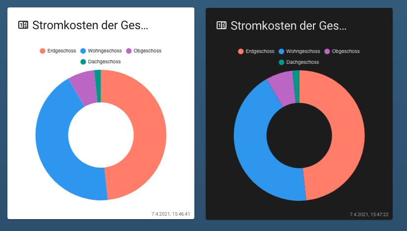
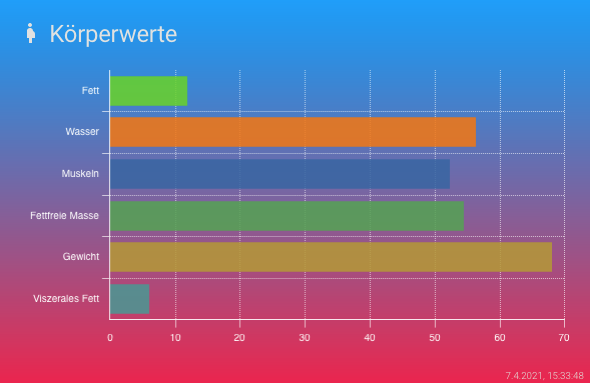

# Lovelace - graph-chartjs-card
## Theme settings

In the standard case, if no settings are made, the settings are adopted from the current theme. These can be overwritten with entries in the theme or in the current card configuration.

<br>




### Home-assitant Theme 

The following theme variables can be set in your HA theme to customize the appearence of the card.

<br>

| Name | Sample | Description |
|------|:-------:|-------------|
| chartjs-text-fontColor | #2F3846 | default color for the font|
| chartjs-fontFamily | Quicksand, Roboto, 'Open Sans','Rubik',sans-serif| default font family |
| chartjs-gridline-color | #EAEEF1| default color gridlines|
| chartjs-zero-gridline-color |#C9CBD0 | default color zero gridline |
| chartjs-tooltip-background | #EAEEF1| default color tooltip background|
| chartjs-text-fontcolor|#292F33 | default color tooltip  |
<br>

####  Sample theme-settings

```yaml
 # Chart.js colors
  chartjs-theme: 'dark'
  chartjs-text-fontColor: '#2F3846'
  chartjs-fontFamily: "Quicksand, Roboto, 'Open Sans','Rubik',sans-serif"
  chartjs-gridline-color: '#EAEEF1'
  chartjs-zero-gridline-color: '#C9CBD0'
  chartjs-tooltip-background: '#EAEEF1'
  chartjs-text-fontcolor: '#292F33'
```
<br>

### Card (YAML) based setting
Another possibility is that the theme settings for a chart are set in the card definition:

####  Sample theme-settings

<br>

```yaml
- type: 'custom:chart-card'
  title: Körperwerte
  icon: 'mdi:human-pregnant'
  height: 320
  chart: horizontalBar
  theme:
    fontcolor: '#FFFFFF'
    gridlinecolor: '#FFFFFF'
    zerolinecolor: '#FFFFFF'
    tooltipsbackground: '#FFFFFF'
    tooltipsfontcolor: '#555555'
    cardbackground: 'linear-gradient(to bottom, #009fff, #ec2f4b);'
  chartOptions:
    plugins:
      title:
        text: Aktuelle Werte
  entities:
    - entity: sensor.peter_koperfett
      name: Fett
    - entity: sensor.peter_korperwasser
      name: Wasser
    - entity: sensor.peter_muskeln
      name: Muskeln
    - entity: sensor.peter_fettfreie_korpermasse
      name: Fettfreie Masse
    - entity: sensor.peter_gewicht
      name: Gewicht
      style:
        gradient:
          colors:
            - '#03a9f4'
            - '#00bcd4'
            - '#8bc34a'
    - entity: sensor.peter_viszerales_fett
      name: Viszerales Fett
```
<br>
<hr>


## Colors Helpers


[Colors Wall](https://colorswall.com) - Place to store your color Palettes

[UI gradients](https://uigradients.com/) - uiGradients - Beautiful colored gradients

