# Lovelace - graph-chartjs-card

<br>

This is higly customizable graph card for [Home-Assistant](https://www.home-assistant.io/)'s Lovelace UI.

Graph ChartJS Chart `Version 2.1.5` for Home Assistant -  Visualize your data in different ways- `BAR`, `HORIZONTALBAR` ,`SEGMENTEDBAR`, `PIE`, `DOUGHNUT`, `LINE`,`RADAR`,`SCATTR`,`BUBBLE` - ; each of them animated and customisable. Respects the set Homeassistant `locale` for numbers and dates

It is based on [chart.js](https://chartjs.org) and offers most of the features of the library.

<br>

## 1. Bar Charts


| 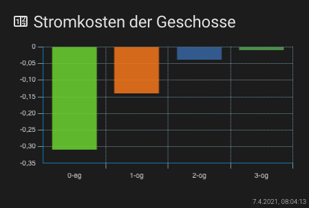 | 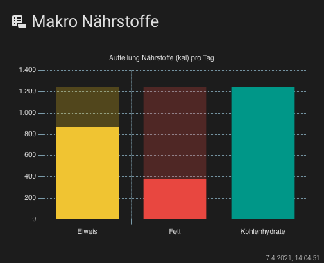 | 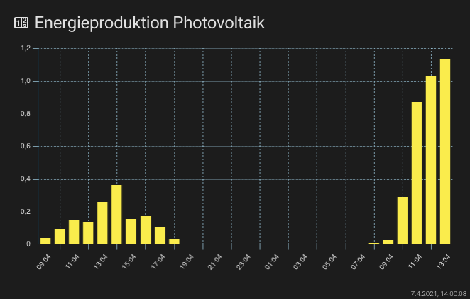 | 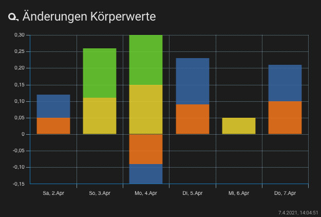 |
| ------------------------------------------------------------ | ------------------------------------------------------------ | ------------------------------------------------------------ | ------------------------------------------------------------ |
| **Bar Chart State based**                                    | **Bar Chart State based (segmented)**                        | **Bar Chart Timeseries**                                     | **Bar Chart Timeseries  stacked**                            |

▶︎ [Bar Charts Examples see](./getting-started/chart-types/barchart.md)

<br>

## 2. Horizontal Bar Chart

| 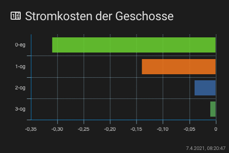 | 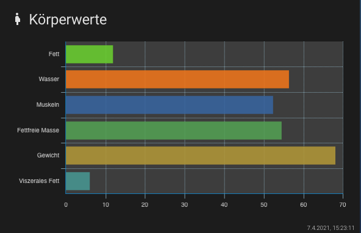 |
| ------------------------------------------------------------ | ------------------------------------------------------------ |
| **Horizontal Bar Chart State based**                         | **Horizontal Bar Chart State based**                         |

▶︎ [Horizontal Bar Example see](./getting-started/chart-types/horizontalBar.md)

<br>

## 3. Pie- & **Doughnut** Charts


| 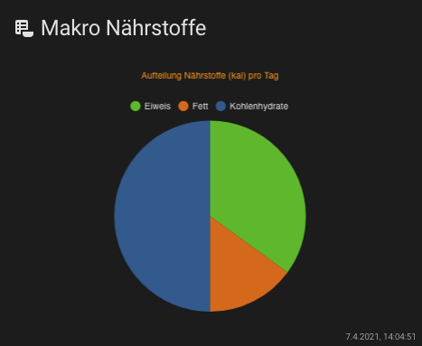 | 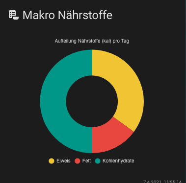 |
| ------------------------------------------------------------ | ------------------------------------------------------------ |
| **Pie Chart State based**                                    | **Doughnut ChartState based**                                |

▶︎ [Pie Chard Example see](./getting-started/chart-types/piechard.md)

▶︎ [ Doughnut Chard Example see](./getting-started/chart-types/doughnut.md)

<br>

## 4. Line Charts

| 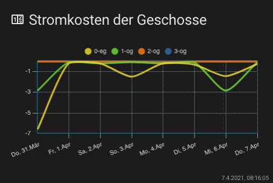 | 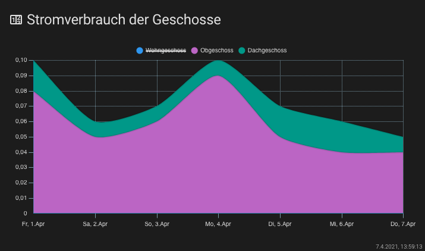 | 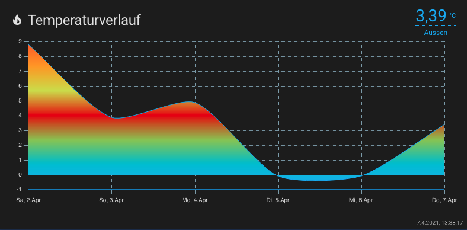 | 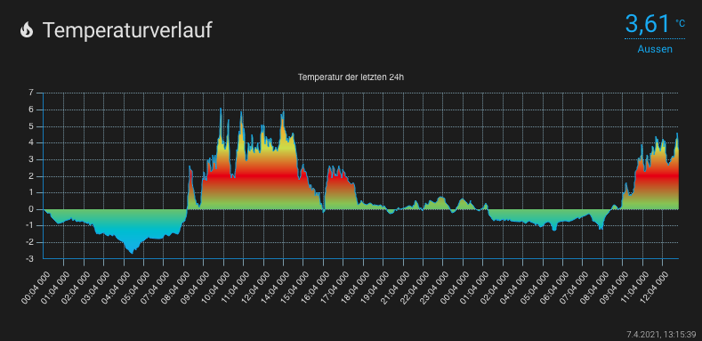 |
| ------------------------------------------------------------ | ------------------------------------------------------------ | ------------------------------------------------------------ | ------------------------------------------------------------ |
| **Line Chart Timeseries**                                    | **Area (line) Chart stacked Timeseries**                     | **Line Chart (filled) Timeseries**                           | **Line Chart (filled) Timeseries**                           |

▶︎ [Line Charts Example see](./getting-started/chart-types/line.md)

<br>

## 5. Mixed Charts

| 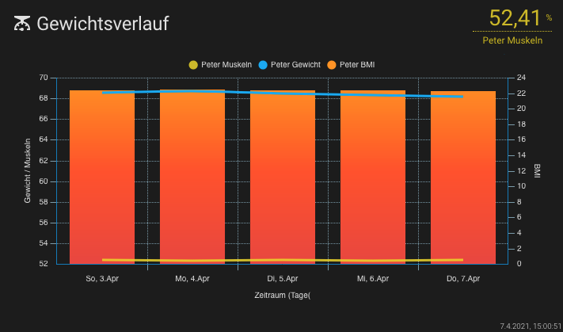 |
| ------------------------------------------------------------ |
| **Mixed Chart (Bar and Lines)  Timeseries**                  |

▶︎ [Mixed Charts Example see](./getting-started/chart-types/mixedcharts.md)

<br>

## 6. Radar - & Scatter Charts

| 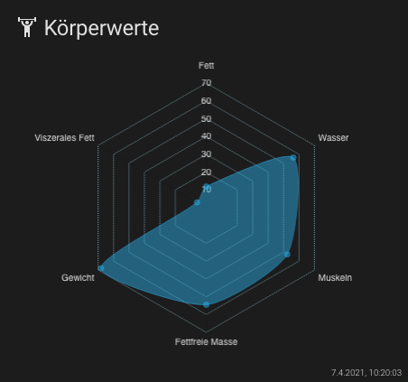 | 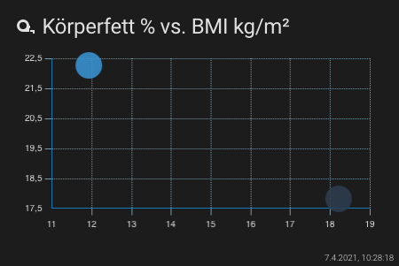 | 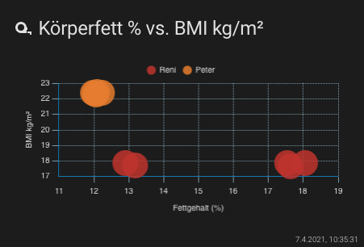 |      |
| ------------------------------------------------------------ | ------------------------------------------------------------ | ------------------------------------------------------------ | ---- |
| **Radar Chart State based**                                  | **Scatter Chart State based**                                | **Scatter Chart Timeseries**                                 |      |
|                                                              |                                                              |                                                              |      |

▶︎ [Radar Chart Example see](./getting-started/chart-types/radarcharts.md)

▶︎ [Scatter Chart Example see](./getting-started/chart-types/scattercharts.md)

<br>

## 7. Bubble Charts


| 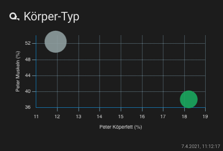 | 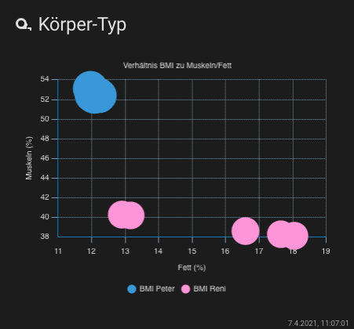 |
| ------------------------------------------------------------ | ------------------------------------------------------------ |
| **Bubble Chart State based**                                 | **Bubble Chart Timeseries**                                  |

▶︎ [Bubble Chart Example see](./getting-started/chart-types/bubblechart.md)

<br>


## Installation


### Requirements

\- Home Assistant 2021.3.4

  \- Frontend-Version: 20210302.6 - latest

  \- Lovelace Mode

\- Tested Browser

  \- Chrome Version 86.0.4240.111 

  \- Safari Version 13.1.2 (13609.3.5.1.5)

  \- Firefox 82.0 (64-Bit)

  \- Vivaldi 3.4.2066.76 (Stable channel) (x86_64)

  \- Android Browser (Chrome, Firefox, Vivaldi)

\- Lovelace chart-card (Chart.js v3.3.1)

<br>

### Manual install

1. Download the [latest release](https://github.com/zibous/lovelace-graph-chart-card/releases), unzip and copy the folder `chart-card` into your `config/www/community` directory.
  <br>

2. Add a reference to `chart-card-min.js` inside your `ui-lovelace.yaml` or at the top of the *raw config editor UI*:

    ```yaml
    resources:
      - url: /hacsfiles/chart-card/chart-card-min.js
        type: module
    ```
<br>

YAML Structure for `custom:chart-card`

```yaml
## -------------------------------------
## all settings for a custom-chart-card
## -------------------------------------
- type: 'custom:chart-card'
  ## all for the card
  title: '{text: card-titel}'
  icon: '{text: card-title-icon}'
  height: {height-chard: number}px
  chart: '{chart-type: line|radar|bar|horizontalBar|pie|doughnut|polarArea|bubble|scatter}'
  ## optional settings for chart
  showstate: {boolean: true|false}
  debug: {boolean: true|false}
  cardtimestamp: {boolean: true|false}
  showdetails:
    title: '{text: table-title}'
    title_sensor: '{text: table-header}'
    title_mean: '{text: table-header}'
    title_min: '{text: table-header}'
    title_max: '{text: table-header}'
    title_current: '{text: table-header}'
    title_timestamp: '{text: table-header}'
    visible: {boolean: true|false}
  loader: '{text: audio|ball-triangle|bars|circles|grid|hearts|'
           'oval|pfuff|rings|spinning-circles|tail-spin|three-dots}'
  update_interval: {integer: secunds}  
  ## optional theme settings
  theme:
    fontcolor: '{text: HEX|RGB|RGBA color}'
    gridlinecolor: '{text: HEX|RGB|RGBA color}'
    zerolinecolor: '{text: HEX|RGB|RGBA color}'
    tooltipsbackground: '{text: HEX|RGB|RGBA color}'
    tooltipsfontcolor: '{text: HEX|RGB|RGBA color}'
    cardbackground: '{text: HEX|RGB|RGBA color}'
  ## optional settings for data scales (time-series)
  datascales:
    range: {integer}
    unit: '{text: millisecond|datetime|secund|minute|hour|day|month|year}'
    factor: {number: factor}
    ignoreZero: {boolean: true|false}
    aggregate: '{text: first|last|sum|mean|max|min}'
    
  ## optional chart.js options (see chart.js documentation) 
  chartOptions:
    plugins:
      legend:
        position: '{text: top|right|left|bottom}'
        display: {boolean: true|false}
    scales:
      x:
        alignToPixels: {boolean: true|false}
        stacked: {boolean: true|false}
        offset: {boolean: true|false}
        title:
          display: {boolean: true|false}
          text: '{text: axis-title}'
      'y':
        alignToPixels: {boolean: true|false}
        stacked: {boolean: true|false}
        title:
          display: {boolean: true|false}
          text: '{text: axis-title}'
  entities:
    ## optional options for all entities
    - options:
      unit: '{text: unit-text}'
      ignoreZero: {boolean: true|false} 
      
    - entity: '{text: entity-id}'
      ## optional settings for the current entity (1st)
      name: '{text: display-text}'
      attribute: '{text: entity-attribute-name}'
      unit: '{text: unit-text}'
      ignoreZero: {boolean: true|false}
      aggregate: '{text: first|last|sum|mean|max|min}'
      style: ## see chart.js documentation
        backgroundColor: '{text: HEX|RGB|RGBA color}'
        
    - entity: '{text: entity-id}'
      ## optional settings for the current entity (2nd)
      name: '{text: display-text}'
      attribute: '{text: entity-attribute-name}'
      factor: {number: factor}
      aggregate: '{text: first|last|sum|mean|max|min}'
      style: ## see chart.js documentation
        backgroundColor: '{text: HEX|RGB|RGBA color}'

    - entity: '{text: entity-id}'
      dataid: '{text: unique id}'
      datasource:        
        influxdb: '{text: influxdb connection}'
        query: '{text: influxdb SQL statement}'
        token: '{text: btoa(user:passwort)}'
```

<br>

For `chartOptions` and `entity.style`,   see: [Chart.js documentation](https://www.chartjs.org/docs/latest/)

<br>

## Creating a Chart

It's easy to get started with `Lovelace - graph-chartjs-card`. All that's required is the libraries included in your Home-assistant installation to render the charts.

In this example, we create a bar chart for a two dataset and render that in the lovelace page. [Data source](https://github.com/zibous/ha-miscale2) - See --> Read weight measurements from Xiaomi Body Scales....


## 

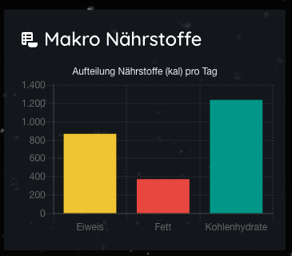

<br>

### YAML Configuration

```yaml
- type: 'custom:chart-card'
  title: 'Makro Nährstoffe'
  icon: 'mdi:nutrition'
  chart: 'bar'
  chartOptions:
    plugins:
      title:
        display: true
        text: 'Aufteilung Nährstoffe (kal) pro Tag'
        color: '#ff9500'
  entities:
    - entity: sensor.eiweis_makronahrstoff
      name: Eiweis
    - entity: sensor.fett_makronahrstoff
      name: Fett
    - entity: sensor.kohlenhydrate_makronahrstoff
      name: Kohlenhydrate
```

<br>

You can see all the ways to use `Lovelace - graph-chartjs-card` in the [usage documentation](./getting-started/index.md).