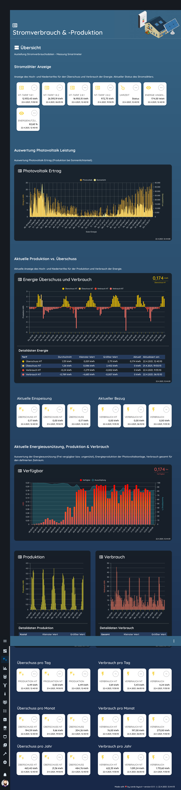
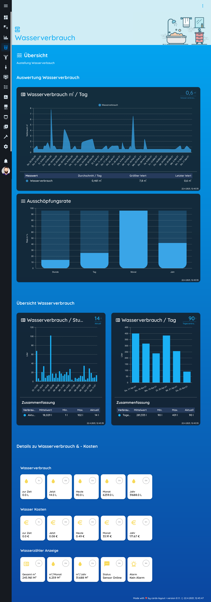

# Lovelace - graph-chartjs-card

 

## Lovelace Examples

 

## Example 1

 
## Example 2

 
## Example 3

 
## Example 4

 

ha-layoutcard see: https://github.com/zibous/ha-layoutcard
simple-card see: https://github.com/zibous/ha-simple-card
 
miscale see: https://github.com/zibous/ha-miscale2
ha-watermeter see: https://github.com/zibous/ha-watermeter

